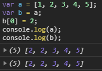
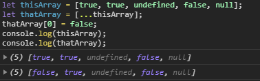

- [Array](#array)
  * [Collection of Data](#collection-of-data)
  * [Access Contents of an Array](#access-contents-of-an-array)
  * [push() & unshift()](#push-----unshift--)
  * [pop() & shift()](#pop-----shift--)
  * [splice()](#splice--)
  * [slice()](#slice--)
  * [Copy an Array with the Spread Operator](#copy-an-array-with-the-spread-operator)
  * [Combine Arrays with the Spread Operator](#combine-arrays-with-the-spread-operator)
  * [indexOf()](#indexof--)
  * [Using For Loops](#using-for-loops)
- [Object](#object)
  * [Add Key-Value Pairs to Objects](#add-key-value-pairs-to-objects)
  * [Modify an Object Nested Within an Object](#modify-an-object-nested-within-an-object)
  * [delete Keyword](#delete-keyword)
  * [hasOwnProperty()](#hasownproperty--)
  * [for ... in statement](#for--in-statement)
  * [Generate an Array of All Object Keys](#generate-an-array-of-all-object-keys)

<small><i><a href='http://ecotrust-canada.github.io/markdown-toc/'>Table of contents generated with markdown-toc</a></i></small>


# Array

## Collection of Data

* one-dimensional array

  ```js
  let simpleArray = ['one', 2, 'three', true, false, undefined, null];
  console.log(simpleArray.length);
  // logs 7
  ```

* multi-dimensional array

  ```js
  let complexArray = [
    [
      {
        one: 1,
        two: 2
      },
      {
        three: 3,
        four: 4
      }
    ],
    [
      {
        a: "a",
        b: "b"
      },
      {
        c: "c",
        d: "d"
      }
    ]
  ];
  ```

## Access Contents of an Array

* use *bracket notation* `[]`

  ```js
  let ourArray = ["a", "b", "c"];
  let ourVariable = ourArray[0];
  // ourVariable equals "a"
  ourArray[1] = "not b anymore";
  // ourArray now equals ["a", "not b anymore", "c"];
  ```

## push() & unshift()

```js
let twentyThree = 'XXIII';
let romanNumerals = ['XXI', 'XXII'];

romanNumerals.unshift('XIX', 'XX');
// now equals ['XIX', 'XX', 'XXI', 'XXII']

romanNumerals.push(twentyThree);
// now equals ['XIX', 'XX', 'XXI', 'XXII', 'XXIII']Notice that we can also pass variables, which allows us even greater flexibility in dynamically modifying our array's data.
```

## pop() & shift()

```js
let greetings = ['whats up?', 'hello', 'see ya!'];

greetings.pop();
// now equals ['whats up?', 'hello']

greetings.shift();
// now equals ['hello']

let popped = greetings.pop();
// returns 'hello'
// greetings now equals []
```

## splice()

* remove any number of consecutive elements
* can take up to 3 parameters
  * first: to begin removing elements
  * second: the number of elements to delete

  ```js
  let array = ['today', 'was', 'not', 'so', 'great'];

  array.splice(2, 2);
  // remove 2 elements beginning with the 3rd element
  // array now equals ['today', 'was', 'great']
  ```

* returns a new array containing the value of the removed elements

  ```js
  let array = ['I', 'am', 'feeling', 'really', 'happy'];
  
  let newArray = array.splice(3, 2);
  // newArray equals ['really', 'happy']
  ```

* Using third parameter, splice() add one or more elements to array.

  ```js
  const numbers = [10, 11, 12, 12, 15];
  const startIndex = 3;
  const amountToDelete = 1;
  
  numbers.splice(startIndex, amountToDelete, 13, 14);
  // the second entry of 12 is removed, and we add 13 and 14 at the same index
  console.log(numbers);
  // returns [ 10, 11, 12, 13, 14, 15 ]
  ```

## slice()

* copies or *extracts* a given number of elements to a new array, leaving the array it is called upon untouched.

* 2 parameters

  * first: the index at which to begin extraction
  * second: the index at which to stop extraction(not including the element at this index)

  ```js
  let weatherConditions = ['rain', 'snow', 'sleet', 'hail', 'clear'];
  
  let todaysWeather = weatherConditions.slice(1, 3);
  // todaysWeather equals ['snow', 'sleet'];
  // weatherConditions still equals ['rain', 'snow', 'sleet', 'hail', 'clear']
  ```

## Copy an Array with the Spread Operator

* Spread operator allows us to easily copy *all* of an array's elements, in order.

```js
let thisArray = [true, true, undefined, false, null];
let thatArray = [...thisArray];
// thatArray equals [true, true, undefined, false, null]
// thisArray remains unchanged, and is identical to thatArray
```





* **Spread operator isn't an array, it is values separated by comma.**

```js
function copyMachine(arr, num) {
  let newArr = [];
  while (num >= 1) {
    // Only change code below this line
    newArr.push([...arr]);
    // Only change code above this line
    num--;
  }
  return newArr;
}

console.log(copyMachine([true, false, true], 2));

```

## Combine Arrays with the Spread Operator

```js
et thisArray = ['sage', 'rosemary', 'parsley', 'thyme'];

let thatArray = ['basil', 'cilantro', ...thisArray, 'coriander'];
// thatArray now equals ['basil', 'cilantro', 'sage', 'rosemary', 'parsley', 'thyme', 'coriander']
```

## indexOf()

* allows us to quickly and easily check for the presence of an element on an array
* takes an element as parameter
* return
  * if not exist: `-1`
  * if exist: the index of the element

```js
let fruits = ['apples', 'pears', 'oranges', 'peaches', 'pears'];

fruits.indexOf('dates'); // returns -1
fruits.indexOf('oranges'); // returns 2
fruits.indexOf('pears'); // returns 1, the first index at which the element exists
```

## Using For Loops

```js
function greaterThanTen(arr) {
  let newArr = [];
  for (let i = 0; i < arr.length; i++) {
    if (arr[i] > 10) {
      newArr.push(arr[i]);
    }
  }
  return newArr;
}

greaterThanTen([2, 12, 8, 14, 80, 0, 1]);
// returns [12, 14, 80]
```

# Object

## Add Key-Value Pairs to Objects

* Collections of *key-value* pairs.

  ```js
  const tekkenCharacter = {
    player: 'Hwoarang',
    fightingStyle: 'Tae Kwon Doe',
    human: true
  };
  tekkenCharacter.origin = 'South Korea';
  tekkenCharacter['hair color'] = 'dyed orange'; // a way that if your property has a space in it or if you want to use a variable to name the property.
  const eyes = 'eye color';
  tekkenCharacter[eyes] = 'brown';
  ```

* Result

  ```js
  {
    player: 'Hwoarang',
    fightingStyle: 'Tae Kwon Doe',
    human: true,
    origin: 'South Korea',
    'hair color': 'dyed orange',
    'eye color': 'brown'
  };
  ```

## Modify an Object Nested Within an Object

```js
let nestedObject = {
  id: 28802695164,
  date: 'December 31, 2016',
  data: {
    totalUsers: 99,
    online: 80,
    onlineStatus: {
      active: 67,
      away: 13,
      busy: 8
    }
  }
};
nestedObject.data.onlineStatus.busy = 10;
```

## delete Keyword

```js
delete foods.apples;
```

## hasOwnProperty()

```js
users.hasOwnProperty('Alan');
'Alan' in users;
// both return true
```

## for ... in statement

```js
for (let user in users) {
  console.log(user);
}

// logs:
Alan
Jeff
Sarah
Ryan
```

> Objects do not maintain an ordering to stored keys like arrays do

## Generate an Array of All Object Keys

* `Object.key()`: return an array with strings representing each property in the object. the will be not specific order to the entries in the array.

  ```js
  function getArrayOfUsers(obj) {
    // Only change code below this line
    return Object.keys(obj);
    // Only change code above this line
  }
  // return [ 'Alan', 'Jeff', 'Sarah', 'Ryan' ]
  ```

  