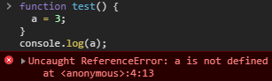

# JavaScript

## Comment

- `//`, `/* *`

## Data Type

- undefined, null, boolean, string, symbol, bigint, number, object
- Any of the eight data types may be stored in a variable.
- *Declare* a variable

```jsx
var ourName;
```

## undefined type

- Variables have an initial value of undefined.
- Operating with an `undefined` variable, the result will be `NaN` which means "*Not a Number*"
- Concatenating a string with an `undefined` variable, you will get a literal string of `"undefined"`

## Case Sensitivity in Variables

- It is possible to have multiple distinct variables with the same name but different casing. ex) `MYVAR`, `MYVar`, `myvar`
- *camelCase* is best practice.

## Operation

- Add: `+`
- Subtract: `-`
- Multiply: `*`
- Divide: `/`
- Increment: `++`
- Decrement: `--`
- Remainder: `%`
  
    - Does not work properly with negative numbers.
- Compound assignment
    - Augmented addition

    ```jsx
    var myVar = 1;
    myVar += 5;
    console.log(myVar); // Returns 6
    ```

    - Augmented subtract, multiplication,  division(similar)

## Create Decimal Numbers

```jsx
var myDecimal = 5.7;
```

- [https://en.wikipedia.org/wiki/Floating-point_arithmetic#Accuracy_problems](https://en.wikipedia.org/wiki/Floating-point_arithmetic#Accuracy_problems)

## String

- Declare

```jsx
var myName = "your name" // "your name" is called a string literal
```

- Escape
    - You can *escape* a quote from considering it.
    - Use a backslash `\`
    - This signals to JavaScript that the following quote is not the end of the string, but should instead appear inside the string.
    
- Quoting strings with single quotes

    ```jsx
    conversation = 'Finn exclaims to Jake, "Algebraic!"';
    ```

    | escape sequences | character       |
    | ---------------- | --------------- |
    | \\'              | double quote    |
    | \\               | backslash       |
    | \n               | newline         |
    | \r               | carriage return |
    | \t               | tab             |
    | \b               | word            |
    | \f               | form feed       |

    

- Concatenation operator

    ```jsx
    'My name is Alan,' + ' I concatenate.'
    ```

    - with the plus equals operator

        ```jsx
        var ourStr = "I come first. ";
        ourStr += "I come second.";
        ```

    - with variables

        ```jsx
        var ourName = "freeCodeCamp";
        var ourStr = "Hello, our name is " + ourName + ", how are you?";
        ```

    - appending variables

        ```jsx
        var anAdjective = "awesome!";
        var ourStr = "freeCodeCamp is ";
        ourStr += adAdjective;
        ```

- Find the length of a string: `.length`

- Bracket notation

    ```jsx
    var firstNmae = "Charles";
    var firstLetter = firstName[0];
    ```

- Immutability

    ```jsx
    var myStr = "Bob"; // can't change the value of myStr
    myStr[0] = "J"; // trying to change the individual characters of a string *litral*
    ```

    ```jsx
    var myStr = "Bob";
    myStr = "Job"; // The only way to change myStr would be to assing it with a new string.
    ```

## Array

- Declaration

    ```jsx
    var sandwich = ["peanut butter", "jelly", "bread"];
    ```

- Multi-dimensional array

    ```jsx
    [["Bulls", 23], ["white Sox", 45]]
    ```

- Access Array data

    ```jsx
    var array = [50,60,70];
    array[0]; // equals 50
    var data = array[1];  // equals 60
    ```

- Unlike strings, the entries of arrays are *mutable*.

    ```jsx
    var ourArray = [50,40,30];
    ourArray[0] = 15; // equals [15,40,30]
    ```

- Access multi-dimensional arrays

    ```jsx
    var arr = [
      [1,2,3],
      [4,5,6],
      [7,8,9],
      [[10,11,12], 13, 14]
    ];
    arr[3]; // equals [[10,11,12], 13, 14]
    arr[3][0]; // equals [10,11,12]
    arr[3][0][1]; // equals 11
    ```

- `push()`: append data to the end of an array

    ```jsx
    var arr1 = [1,2,3];
    arr1.push(4);
    // arr1 is now [1,2,3,4]

    var arr2 = ["Stimpson", "J", "cat"];
    arr2.push(["happy", "joy"]);
    // arr2 now equals ["Stimpson", "J", "cat", ["happy", "joy"]]
    ```

- `pop()`: removes the last element from an array and returns that element.

    ```jsx
    var threeArr = [1, 4, 6];
    var oneDown = threeArr.pop();
    console.log(oneDown); // Returns 6
    console.log(threeArr); // Returns [1, 4]
    ```

- `shift()`: removes the first element from an array and returns that element.

    ```jsx
    var ourArray = ["Stimpson", "J", ["cat"]];
    var removedFromOurArray = ourArray.shift();
    // removedFromOurArray now equals "Stimpson" and ourArray now equals ["J", ["cat"]].
    ```

- `unshift()`: add the element at the start of the array

    ```jsx
    var ourArray = ["Stimpson", "J", "cat"];
    ourArray.shift(); // ourArray now equals ["J", "cat"]
    ourArray.unshift("Happy");
    // ourArray now equals ["Happy", "J", "cat"]
    ```

## Function

- Declaration

    ```jsx
    function functionName() {
      console.log("Hello World");
    }
    functionName(); // invoke
    ```

- Passing values to functions with arguments

    ```jsx
    function testFun(param1, param2) { // parameters
      console.log(param1, param2);
    }
    testFun("Hello", "World"); // "Hello" and "World" are arguements.
    ```

- Global scope and functions
    - scope: the visibility of variables
    
    - Global scope: variables which are defined outside of a function block; they can be seen everywhere in your JavaScript code.

    - Variables which are used without the var keyword are automatically created in the global scope. ⇒ unintended consequences

        

        
    
- Local scope and functions
    - Local scope: declared within a function, as well as the function parameters; they are only visible within that function.

        ```jsx
        function myTest() {
          var loc = "foo";
          console.log(loc);
        }
        myTest(); // logs "foo"
        console.log(loc); // loc is not defined
        ```

- Global vs. Local Scope in Functions
    - It is possible to have both local and global variables with the same name.
    - The local variable takes precedence over the global variable.

    ```jsx
    var someVar = "Hat";
    function myFun() {
      var someVar = "Head";
      return someVar;
    }
    ```

- Return a value

    ```jsx
    function plusThree(num) {
      return num + 3;
    }
    var answer = plusThree(5); // 8
    ```

- Undefined value returned from a function
    - When the function doesn't have a `return` statement, the returned value is `undefined`.

    ```jsx
    var sum = 0;
    function addSum(num) {
      sum = sum + num;
    }
    addSum(3); // sum will be modified but returned value is undefined
    ```

## Boolean

- `true` or `false`

## Conditional Logic

- If statements

    ```jsx
    function test (myCondition) {
      if (myCondition) {
         return "It was true";
      }
      return "It was false";
    }
    test(true);  // returns "It was true"
    test(false); // returns "It was false"
    ```

- Comparison operator
    - Equality: `==`
        - If compare two different data types, it must convert one type to another ("Type Coercion");
        - However, it attempts to convert both values being compared to a common type

        ```jsx
        3 ==  3   // true
        3 == '3'  // true
        ```

    - Strict Equality: `===`
        - does not perform a type conversion.

        ```jsx
        3 ===  3   // true
        3 === '3'  // false
        ```

        How to determine the type of a variable or a value
        `typeof 3   // returns 'number'`
        `typeof '3' // returns 'string'`

    - Inequality: `!=`
      
        - Like the equality operator, it will convert data types of values while comparing.
    - Strict Inequality: `!==`
      
        - will not convert data types.
    - Greater than: `>`
      
        - will convert data types of values
    - Greater than or equal to: `>=`
      
        - will convert data types of values
    - Less than: `>`
      
        - will convert data types of values
    - Less than or equal to: `<=`
      
        - will convert data types of values
    - Logical And: `&&`
    - Logical Or: `||`
- `else` statements
  
    - an alternate block of code can be executed when if statement is false.
- `else if` statement
- `switch` statements
    - `case` values are tested with strict equality.
    - `default` statement will be executed if no matching `case` statements are found.

## Object

- Declaration
    - access the data in objects through what are called `properties`.

        ```jsx
        var cat = {
          "name": "Whiskers",
          "legs": 4,
          "tails": 1,
          "enemies": ["Water", "Dogs"]
        };
        ```

    - If your object has any non-string properties, JavaScript will automatically typecast them as strings.
- Access
    - use dot notation(`.`)

        ```jsx
        var myObj = {
          prop1: "val1",
          prop2: "val2"
        };
        var prop1val = myObj.prop1; // val1
        var prop2val = myObj.prop2; // val2
        ```

    - or bracket notation(`[]`)
        - If the property of the object  has a space in its name

        ```jsx
        var myObj = {
          "Space Name": "Kirk",
          "More Space": "Spock",
          "NoSpace": "USS Enterprise"
        };
        myObj["Space Name"]; // Kirk
        myObj['More Space']; // Spock
        myObj["NoSpace"];    // USS Enterprise
        ```

    - Use `bracket notation` when accessing object properties with variables.
- Add new properties
    - the same way you would modify them.

    ```jsx
    var ourDog = {
      "name": "Camper",
      "legs": 4,
      "tails": 1,
      "friends": ["everything!"]
    };

    ourDog.bark = "bow-wow";
    ```

- Delete properties
    - `delete ourDog.bark;`

    ```jsx
    var ourDog = {
      "name": "Camper",
      "legs": 4,
      "tails": 1,
      "friends": ["everything!"],
      "bark": "bow-wow"
    };

    delete ourDog.bark;
    ```

- Testing objects for properties: `.hasOwnProperty(propname)`

## Iterate

- while

    ```jsx
    var ourArray = [];
    var i = 0;
    while(i < 5) {
      ourArray.push(i);
      i++;
    }
    ```

- for

    ```jsx
    var ourArray = [];
    for (var i = 0; i < 5; i++) {
      ourArray.push(i);
    }
    ```

- do...while

    ```jsx
    var ourArray = [];
    var i = 0;
    do {
      ourArray.push(i);
      i++;
    } while (i < 5);
    ```

## Random

- In some range, `Math.floor(Math.random()*(max-min+1))+min` inclusive min and max

## ParseInt Function

- parses a string and returns an integer
- If the first character in the string can't be converted into a number, then it returns `NaN`.

    ```jsx
    var a = parseInt("007"); // return 7
    ```

- It takes a second argument for the radix.

    ```jsx
    var a = parseInt("11", 2); // return 3
    ```

## Conditional operator(ternary)

```jsx
condition ? statement-if-true : statement-if-false;
```
